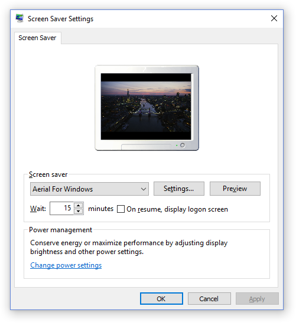
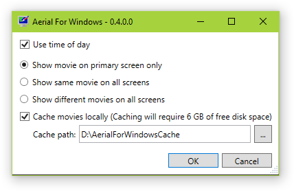

# Aerial For Windows

**Aerial For Windows** is a Windows screen saver inspired by John Coates' [Aerial](https://github.com/JohnCoates/Aerial). It is based on the new Apple TV screen saver that displays the aerial movies Apple shot over New York, San Francisco, Hawaii, China, etc.

As John's work, **Aerial For Windows** is open source.

## Installation

1. Download the latest release from [Releases page](https://github.com/thoemmi/AerialForWindows/releases)
2. Right-click on the downloaded .scr file and select **Install** 

## Features

* **Auto Load Latest Aerials**: The movies are loaded directly from Apple whenever the screen saver starts.
* **Time of day**: There are different movies for day and night. You can choose to show movies matching the current time (thresholds are 7am and 7pm). 
* **Select screens**: If you've got multiple screens, you can select whether there's a movie played only on the primary screen, the same move on all screens, or a different movie on each screen.

**Aerial For Windows** does not cache the movies locally yet. The movies take hundreds of megabytes, so please be aware of the bandwidth consumption.

## Compatibility

**Aerial For Windows** is written in C# targeting [.NET framework 4.5](https://www.microsoft.com/en-us/download/details.aspx?id=30653).

## Planned Features

* Local caching of movies to save bandwidth and faster start of playback
* Selection of favorite locations 
* Windows installer with auto-update

## Community

* **Find a bug?** [Open an issue](https://github.com/thoemmi/AerialForWindows/issues/new). Try to be as specific as possible.
* **Have a feature request?** [Open an issue](https://github.com/thoemmi/AerialForWindows/issues/new). Tell me why this feature would be useful, and why you and others would want it.

## Contribute

I appreciate all pull requests.

## Changelog

* October 29th, 2015 - 0.1
  * First release