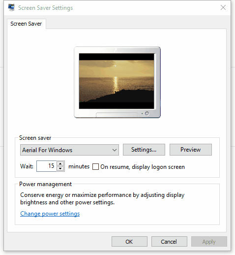
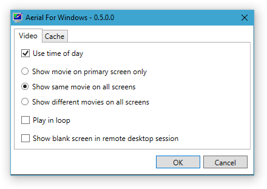
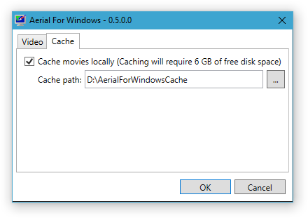

# Aerial For Windows

**Aerial For Windows** is a Windows screen saver inspired by John Coates' [Aerial](https://github.com/JohnCoates/Aerial). It is based on the new Apple TV screen saver that displays the aerial movies Apple shot over New York, San Francisco, Hawaii, China, etc.

As John's work, **Aerial For Windows** is open source.

## Installation

### Using the Setup

Execute the latest setup (*.msi) from the [Releases page](https://github.com/thoemmi/AerialForWindows/releases).

After successful installation the setup will open the **Screen Saver Settings** automatically.

### Manual Installation

1. Download the latest release (*.scr) from the [Releases page](https://github.com/thoemmi/AerialForWindows/releases)
2. Unblock the *.scr* file by opening its properties and clicking **Unblock**
3. Right-click on the downloaded *.scr* file and select **Install** 

## Features

* **Auto Load Latest Aerials:** The movies are loaded directly from Apple whenever the screen saver starts.
* **Time of day:** There are different movies for day and night. You can choose to show movies matching the current time (thresholds are 7am and 7pm). 
* **Select screens:** If you've got multiple screens, you can select whether there's a movie played only on the primary screen, the same move on all screens, or a different movie on each screen.
* **Auto-update:** Both the movie window and the settings dialog show a notification when an update is available.
* **Local Caching:** Option to cache the movies locally. **Note:** This required at least **12 GB** of free disk space.

## Compatibility

**Aerial For Windows** is written in C# targeting [.NET framework 4.5](https://www.microsoft.com/en-us/download/details.aspx?id=30653).

## Planned Features

* Selection of favorite locations 

## Community

* **Find a bug?** [Open an issue](https://github.com/thoemmi/AerialForWindows/issues/new). Try to be as specific as possible.
* **Have a feature request?** [Open an issue](https://github.com/thoemmi/AerialForWindows/issues/new). Tell me why this feature would be useful, and why you and others would want it.

## Contribute

I appreciate all pull requests.

## Changelog

* **April 23, 2017 - v0.6**
  * Added option to play movie on one random screen (#5)
  * Added option to switch off screens after a configurable interval (#6)
* **October 23, 2016 - v0.5**
  * Added choice to either play the same video in a loop, or show a new one.
  * Added option to show blank screen in remote desktop sessions
* **June 19th, 2016 - v0.4**
  * Added local caching
* **June 17th, 2016 - v0.3**
  * Show update notification
  * Settings are now stored in the file system (at `%LOCALAPPDATA%\AerialForWindows`) instead of the registry
  * Added logging (in `%LOCALAPPDATA%\AerialForWindows` too) 
* **November 3rd, 2015 - v0.2**
  * added Setup
  * show error when movie playback fails
* **October 29th, 2015 - v0.1**
  * First release

## License

[MIT License](license.txt)
